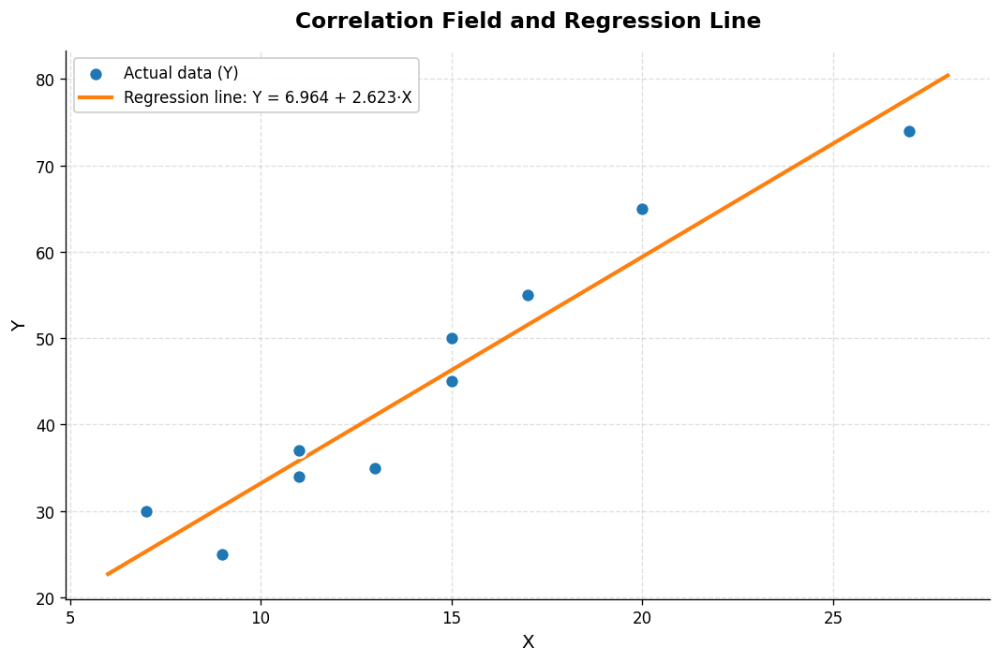
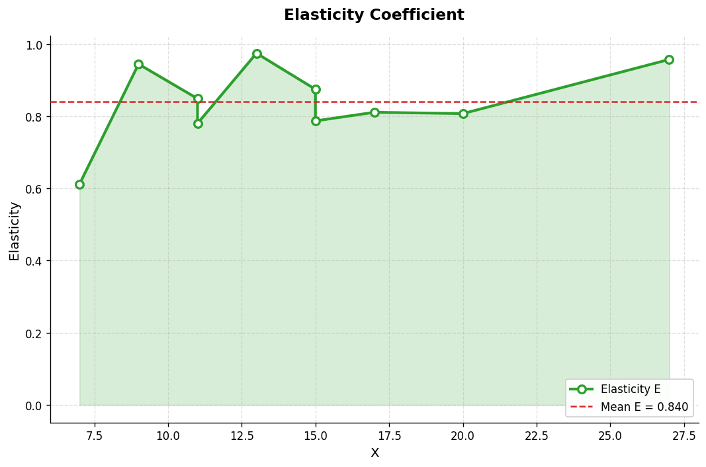

# Simple Linear Regression Analysis

A Python implementation of a one-factor linear econometric model. The project estimates regression coefficients, evaluates model quality via correlation and determination, runs Fisher's F-test and Student's t-test, computes elasticity, produces a point forecast, and visualizes the results with `matplotlib`.

> **Course project:** *Digital Information-Analytical Systems*
> **Author:** Vanin Dmytro
> **University:** V. N. Karazin Kharkiv National University

---

## Problem statement

Given an empirical dataset of an explanatory variable X and a response variable Y, build a one-factor linear regression model:

$$Y = b_0 + b_1 \cdot X$$

Estimate the coefficients, verify model adequacy, test the significance of coefficients, analyze elasticity, and forecast Y at a new X.

## Method

Coefficients are estimated by Ordinary Least Squares (OLS):

$$b_1 = \frac{\sum (X_i - \bar X)(Y_i - \bar Y)}{\sum (X_i - \bar X)^2}, \qquad b_0 = \bar Y - b_1 \cdot \bar X$$

The script then computes:

| Metric | Formula | Purpose |
|---|---|---|
| Pearson correlation r | $r = \mathrm{corr}(X, Y)$ | Strength of linear relationship |
| Determination R² | $R^2 = r^2$ | Share of Y's variation explained by the model |
| Fisher's F-test | $F = \frac{\mathrm{SSR}/1}{\mathrm{SSE}/(n-2)}$ | Overall model adequacy |
| Student's t-test | $t(b) = b / \mathrm{SE}(b)$ | Significance of individual coefficients |
| Elasticity Eᵢ | $E_i = b_1 \cdot X_i / Y_i$ | % change in Y per 1% change in X |
| Point forecast | $\hat Y = b_0 + b_1 \cdot X_\text{new}$ | Prediction at a new X value |

## Project structure

```
simple-linear-regression/
├── main.py               Main analysis script
├── plots.py              Visualization script (matplotlib)
├── data.json             Input dataset
├── requirements.txt      Python dependencies
├── images/               Generated plots
│   ├── regression_line.png
│   └── elasticity.png
└── README.md             This file
```

## Requirements

- Python 3.10 or newer
- NumPy, SciPy, Matplotlib

Install dependencies:

```bash
pip install -r requirements.txt
```

## Usage

Run the statistical analysis:

```bash
python regression.py
```

Generate the plots:

```bash
python plots.py
```

To analyze a different dataset, replace the contents of `data.json` keeping the same structure:

```json
{
  "description": "Your dataset description",
  "X": [...],
  "Y": [...]
}
```

## Sample output

```
============================================================
SIMPLE LINEAR REGRESSION — RESULTS
============================================================

1. REGRESSION EQUATION
------------------------------------------------------------
   Y = 6.964 + 2.623 * X

2. CORRELATION & DETERMINATION
------------------------------------------------------------
   Pearson correlation     r   = 0.96262
   Coefficient of determ.  R^2 = 0.92664
   → Model explains ~92.7% of Y's variation

3. FISHER'S F-TEST (model adequacy)
------------------------------------------------------------
   F_fact = 101.05
   F_crit = 5.32
   → Model is ADEQUATE at alpha = 0.05

4. STUDENT'S T-TEST (coefficient significance)
------------------------------------------------------------
   t(b0)  = 1.72    (NOT significant)
   t(b1)  = 10.05    (significant)
   t_crit = 2.31

5. ELASTICITY
------------------------------------------------------------
   Mean elasticity = 0.8396
   Range           = [0.6121 … 0.9743]

6. POINT FORECAST
------------------------------------------------------------
   At X = 8.0 → predicted Y = 27.95
```

## Visualizations

### Correlation field and regression line



The blue dots are the observed (X, Y) pairs; the orange line is the fitted regression Y = 6.964 + 2.623·X. The tight clustering of points around the line illustrates the strong positive linear relationship (r ≈ 0.96).

### Elasticity coefficient



Point elasticities range from 0.61 to 0.97 with a mean of 0.84. All values are below 1, which means the relationship is **inelastic**: a 1% change in X leads to a smaller-than-1% change in Y on average.

## Findings

For the dataset in `data.json`, the fitted model is:

$$Y = 6.964 + 2.623 \cdot X$$

**Interpretation:**

- A unit increase in X raises Y by **2.623** on average.
- The correlation r = 0.96262 indicates a very strong positive linear relationship.
- R² = 0.92664: the model explains roughly **92.7%** of the variation in Y; only ~7.3% is attributable to unobserved factors.

**Adequacy:**

- Fisher's test: F_fact = 101.05 ≫ F_crit ≈ 5.32, so the model is statistically significant at α = 0.05.
- Student's test: t(b₁) = 10.05 ≫ t_crit ≈ 2.31, confirming that the slope is significant. The intercept b₀ is not statistically significant (t = 1.72), but it is kept in the model to correctly position the line.

**Elasticity:**

- Mean elasticity ≈ 0.84 (range 0.61 – 0.97) → the relationship is inelastic. A 1% increase in X corresponds to an ~0.84% increase in Y on average.

**Forecast:**

- At X = 8.0, the predicted value is Y = 27.95.

**Conclusion:** the regression model is statistically significant and suitable for forecasting Y within the observed range of X.

## Notes on implementation

This work was originally implemented in Node.js with `jstat` (statistics) and `chart.js` (visualization). The Python version rewrites the same algorithm using NumPy for linear algebra, SciPy for statistical distributions, and Matplotlib for plotting — the standard scientific-Python stack used widely in banking and data analytics.

## License

MIT
